# Commissioning Example & Walkthrough Guide

[](https://www.beckhoff.com/) [](https://infosys.beckhoff.com/) [](https://www.beckhoff.com/)

A practical commissioning project demonstrating how to integrate and run the `Tc3_LmDualAxisCoordinator` library. It guides you through creating and linking NC axes, mapping fieldbus I/O and drive interfaces, running application logic, and operating the system from an example TF2000 web HMI. It demonstrates a hardware-ready setup that can also be run directly on an engineering PC by disabling the I/O devices and enabling the NC axis simulation option.

---

## Table of Contents
* **[1. Prerequisites](#1-prerequisites)**
* **[2. Step-by-Step Commissioning Guide](#2-step-by-step-commissioning-guide)**
  * [Step 1: Installing the Compiled Library into the Repository](#step-1-installing-the-compiled-library-into-the-repository)
  * [Step 2: Adding the Library Reference to the PLC Project](#step-2-adding-the-library-reference-to-the-plc-project)
  * [Step 3: Application Implementation & Library Exploration](#step-3-application-implementation--library-exploration)
    * [3.1 Minimal Declaration & IntelliSense Parameter Inspection](#31-minimal-declaration--intellisense-parameter-inspection)
    * [3.2 In-IDE Library Documentation (Library Manager)](#32-in-ide-library-documentation-library-manager)
    * [3.3 Application Data Architecture: GVLs & Interface Structs](#33-application-data-architecture-gvls--interface-structs)
    * [3.4 Full Commissioning Application Layer (MAIN & Mapping Blocks)](#34-full-commissioning-application-layer-main--mapping-blocks)

  * [Step 4: Adding Master & Slave NC Axes](#step-4-adding-master--slave-nc-axes)
  * [Step 5: Adding Fieldbus & Hardware I/O Devices](#step-5-adding-fieldbus--hardware-io-devices)
  * [Step 6: Process Image Linking (Axes & Digital Inputs)](#step-6-process-image-linking-axes--digital-inputs)
  * [Step 7: Running on a PC (Axis Simulation & I/O Disabling)](#step-7-running-on-a-pc-axis-simulation--io-disabling)
  * [Step 8: Activation, Run Mode & HMI Deployment](#step-8-activation-run-mode--hmi-deployment)
* **[3. Live Feature Demonstrations](#3-live-feature-demonstrations)**
  * [1. Axis Configuration & Tuning Drawer](#1-axis-configuration--tuning-drawer)
  * [2. Controlled Deceleration Stop on Software Disable](#2-controlled-deceleration-stop-on-software-disable)
  * [3. On-The-Fly Trajectory Retargeting (MoveAbs & MoveVelo Ping-Pong)](#3-on-the-fly-trajectory-retargeting-moveabs--movevelo-ping-pong)
  * [4. Coupling Policy: PERSISTENT_TANDEM](#4-coupling-policy-persistent_tandem)
  * [5. Coupling Policy: MODULAR_TANDEM_STOP](#5-coupling-policy-modular_tandem_stop)
  * [6. Coupling Policy: MODULAR_INDEPENDENT](#6-coupling-policy-modular_independent)
  * [7. Electronic Decoupling in Motion](#7-electronic-decoupling-in-motion)
  * [8. Dynamic Pairing Topologies & Standstill Re-Gearing](#8-dynamic-pairing-topologies--standstill-re-gearing)
  * [9. External NC Motion Tracking (EXTERNAL_MOTION)](#9-external-nc-motion-tracking-external_motion)
  * [10. Deceleration Dynamics: Halt vs. Stop](#10-deceleration-dynamics-halt-vs-stop)
  * [11. Manual Continuous Jogging](#11-manual-continuous-jogging)
  * [12. Simultaneous Dual-Axis Homing Calibration](#12-simultaneous-dual-axis-homing-calibration)
  * [13. NC Dynamic Limit Fault & Hardware Recovery Handshake](#13-nc-dynamic-limit-fault--hardware-recovery-handshake)

---

## 1. Prerequisites

To open, build, and run this solution, ensure the following are installed:

* **TwinCAT 3.1 XAE (Build 4026.x or newer):** The standard TwinCAT engineering environment.
* **TwinCAT NC PTP (Point-to-Point) Motion:** Required for trajectory profile generation and electronic gearing. Available as a free, renewable 7-day trial inside TwinCAT (**SYSTEM → License → 7 Days Trial License**).
* **TF2000 TwinCAT 3 HMI:** The web-based visualization environment required to run the HMI project (`HMI_DualDriveMotion`).
  * **Installation:** Must be installed on your PC via the **Beckhoff TwinCAT Package Manager**.
  * **License:** The HMI Server runtime uses a free, renewable 7-day trial license generated directly inside TwinCAT (**SYSTEM → License**).

> **Note:**  
> The HMI and EtherCAT configurations in this project are practical examples. The motion library itself does not depend on them; it can be driven using standard TwinCAT PLC Visu, physical control panel pushbuttons, or operated directly via the TwinCAT NC Online Tab (F1–F8) and ADS.

## 2. Step-by-Step Commissioning Guide

### Step 1: Installing the Compiled Library into the Repository

Before a TwinCAT PLC project can reference the `Tc3_LmDualAxisCoordinator` library, the pre-compiled library file (`.compiled-library`) must be registered in your workstation's local TwinCAT Library Repository.

#### Procedure:

1. **Open the Library Repository:**
   In the TwinCAT XAE top menu bar, click on **PLC** and select **Library Repository...** from the dropdown menu.

   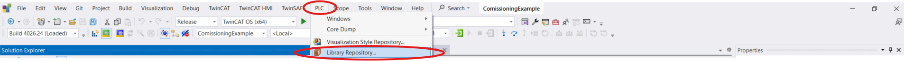

2. **Trigger the Installation:**
   In the **Library Repository** dialog window, ensure the repository location is set to default (**System**) and click the **Install...** button on the right-hand side.

3. **Locate the Compiled Library:**
   In the file browser dialog that opens:
   * Navigate to where the library file is saved:
     * If you cloned the full repository, it is located in the distribution folder:  
       `twincat-dual-axis-coordinator/dist/`
     * If you downloaded only the compiled library file separately, browse to the local folder where you saved it.
   * Ensure the file type filter in the bottom right is set to **TwinCAT 3 PLC compiled library (`*.compiled-library`)** (or **All files**).
   * Select `Tc3_LmDualAxisCoordinator.compiled-library` and click **Open**.

4. **Verify Successful Installation:**
   TwinCAT unpacks and installs the library into your local repository database. In the **Library Repository** window, expand the category tree to confirm that **Tc3_LmDualAxisCoordinator** (Version `1.0.0.0`) is now listed.

   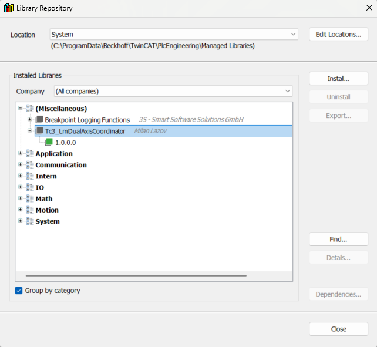

5. **Close the Dialog:**
   Click **Close**. The library is now permanently registered on your engineering PC and ready to be referenced by the PLC project.

### Step 2: Adding the Library Reference to the PLC Project

Once the compiled library is installed in the repository, it must be added to your PLC project references. The standard `Tc2_MC2` library must also be imported in the same way to be able to declare `AXIS_REF`.

#### Procedure:

1. **Open the Add Library Dialog:**
   In the **Solution Explorer**, expand your PLC project, right-click on the **References** folder, and select **Add library...**.

   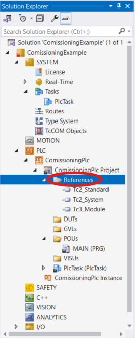

2. **Search and Reference `Tc3_LmDualAxisCoordinator`:**
   In the **Add Library** dialog window:
   * In the search input field at the top, type `Tc3_LmDualAxisCoordinator`.
   * The list will filter automatically to display the library. Click to select **Tc3_LmDualAxisCoordinator**.
   * Click **OK** at the bottom right of the dialog.

   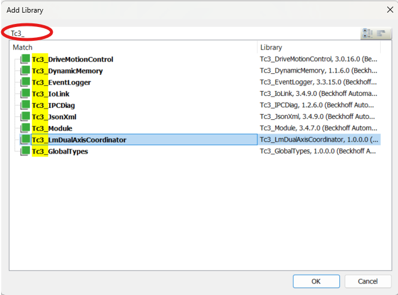

3. **Add the `Tc2_MC2` Library:**
   In the same way, add the standard Beckhoff `Tc2_MC2` library to be able to declare `AXIS_REF`:
   * Right-click **References** and select **Add library...**.
   * Search for `Tc2_MC2`, select it, and click **OK**.

   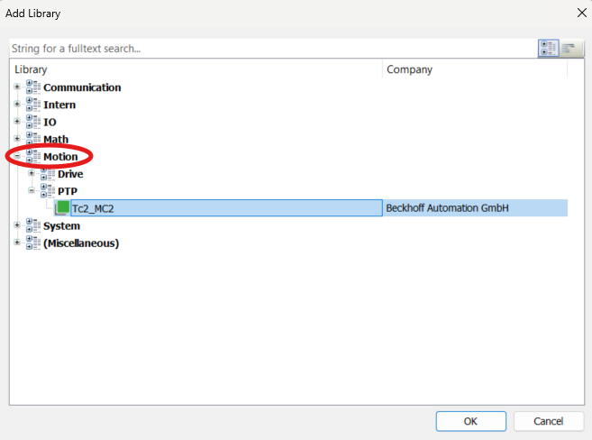

4. **Verify References:**
   Expand the **References** folder in the Solution Explorer. Both **Tc3_LmDualAxisCoordinator** and **Tc2_MC2** should now be visible in the list alongside the standard system libraries. The PLC compiler can now resolve all coordinator function blocks, parameter structures, and NC axis references.


### Step 3: Application Implementation & Library Exploration

Once the library is referenced, you can integrate it into your application code. This section demonstrates how to declare and call the coordinator, explore its parameters using TwinCAT's built-in IntelliSense and Library Manager, and inspect the application layer used in this commissioning example.

---

#### 3.1 Minimal Declaration & IntelliSense Parameter Inspection

To use the dual-axis coordinator in its simplest form, you only need an instance of `FB_AxisDualDrive`, the hardware axis references (`AXIS_REF`), and the required command and configuration structures.

1. **Minimal Program Declaration:**  
   In your program declaration (e.g., `MAIN`), declare the coordinator instance and the mandatory variables:

   ```iec
   PROGRAM MAIN
   VAR
       fbInstanceName1  : FB_AxisDualDrive;

       Axis_Master      : AXIS_REF;
       stMasterConfig   : ST_AxisConfig;
       stMasterCommands : ST_AxisSystemCmd;

       Axis_Slave       : AXIS_REF;
       stSlaveConfig    : ST_AxisConfig;
       stSlaveCommands  : ST_AxisSystemCmd;
   END_VAR
   ```

2. **Exploring Inputs & Outputs via IntelliSense:**  
   In the implementation body, when typing the function block instance call:
   * Typing an opening parenthesis `(` or pressing **Ctrl + Shift + Space** inside the call opens TwinCAT’s parameter tooltip.
   * Typing a comma `,` advances through the parameter list.
   * IntelliSense displays only the public contract (`VAR_INPUT`, `VAR_IN_OUT`, `VAR_OUTPUT`), allowing you to see all available command pins, configuration structures, and status flags without clutter.

   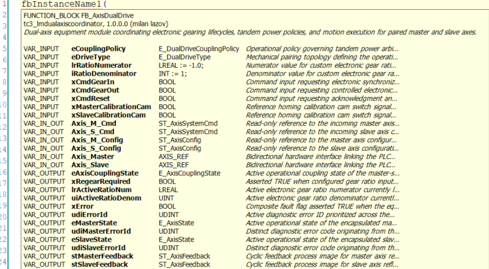

---

#### 3.2 In-IDE Library Documentation (Library Manager)

You do not need to inspect the raw library source code to understand its data types or block behaviors. All function blocks, structures, and enumerations include inline comments that TwinCAT compiles into an integrated reference manual.

* In the **Solution Explorer**, expand **References** and double-click **Tc3_LmDualAxisCoordinator** to open the **Library Manager**.
* Selecting any POU (e.g., `FB_AxisDualDrive`, `FB_AxisController`) or DUT (e.g., `ST_AxisConfig`, `E_AxisError`) displays its full parameter descriptions, valid ranges, and operational rules directly in the XAE editor.

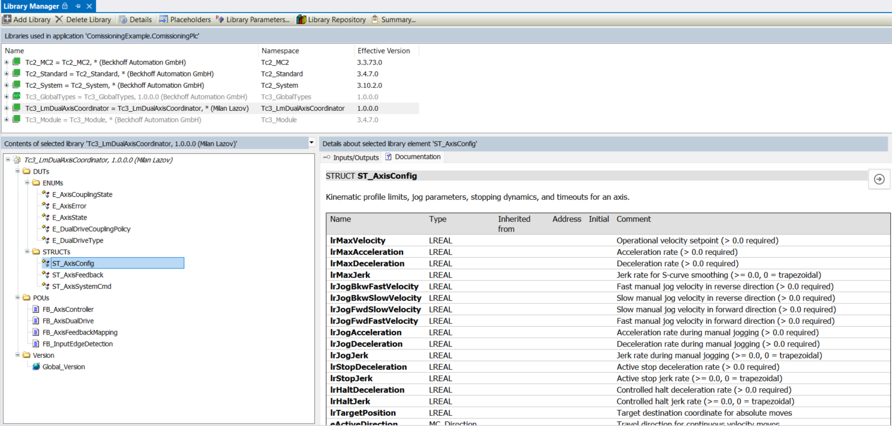

---

#### 3.3 Application Data Architecture: GVLs & Interface Structs

In this commissioning project, variables are organized into global variable lists and interface structures to support both physical I/O and the TF2000 HMI:

* **`GVL_Motion`:** Instantiates the NC hardware axis references (`Axis_M : AXIS_REF`, `Axis_S : AXIS_REF`) and composite visual interface nodes (`Axis_M_Interface`, `Axis_S_Interface`, `DualDrive_Interface`).
* **`GVL_IO`:** Contains the fieldbus process input images (`stMaster_Physical_In AT %I*`, `stSlave_Physical_In AT %I*`) mapped to terminal hardware channels.
* **Interface Structs (`ST_AxisInterface`, `ST_DualDriveInterface`):** Composite containers bundling HMI command tags, configuration parameters, and status readouts into clean visualization nodes.

> **Note on Architecture:**  
> These GVLs and composite interface structs are specific to this commissioning project. They represent one clean way to organize an application, but they are not mandated by the library. You can structure your global data, tags, and memory layout however your machine standard requires.

---

#### 3.4 Full Commissioning Application Layer (MAIN & Mapping Blocks)

The complete application logic is contained in `MAIN.TcPOU`, coordinating process inputs, motion execution, and telemetry egress:

1. **Program Declarations:**  
   `MAIN` declares the input/output mapping helper blocks, local process images, and the primary `fbAxisDualDrive` coordinator instance:

   ```iec
   PROGRAM MAIN
   VAR
       // --- Application Mapping & Execution Instances ---
       fbMasterAxisInputMapping  : FB_AxisInputMapping;  // Combines HMI and physical panel inputs for Master axis
       fbSlaveAxisInputMapping   : FB_AxisInputMapping;  // Combines HMI and physical panel inputs for Slave axis
       
       fbAxisDualDrive           : FB_AxisDualDrive;     // Core dual-axis equipment module coordinating motion & gearing
       
       fbMasterAxisOutputMapping : FB_AxisOutputMapping; // Packs Master telemetry and diagnostics for HMI display
       fbSlaveAxisOutputMapping  : FB_AxisOutputMapping; // Packs Slave telemetry and diagnostics for HMI display

       // --- Master Axis Local Process Data ---
       stMasterAxisSystemCmd     : ST_AxisSystemCmd;     // Arbitrated command pipeline dispatched to Master axis
       stMasterFeedback          : ST_AxisFeedback;      // Live cyclic NC feedback image for Master axis
       eMasterState              : E_AxisState;          // Active operational state of Master axis controller
       udiMasterErrorId          : UDINT;                // Active diagnostic error code for Master axis

       // --- Slave Axis Local Process Data ---
       stSlaveAxisSystemCmd      : ST_AxisSystemCmd;     // Arbitrated command pipeline dispatched to Slave axis
       stSlaveFeedback           : ST_AxisFeedback;      // Live cyclic NC feedback image for Slave axis
       eSlaveState               : E_AxisState;          // Active operational state of Slave axis controller
       udiSlaveErrorId           : UDINT;                // Active diagnostic error code for Slave axis
   END_VAR
   ```

2. **Application Implementation:**  
   The execution sequence runs cyclically in three primary stages:
   * **Ingress Mapping (Steps 1 & 2):** Conditions incoming HMI and physical inputs into `ST_AxisSystemCmd`.
   * **Dual-Drive Coordination (Step 3):** Calls `fbAxisDualDrive` with command pipelines, configurations, and NC hardware handles.
   * **Egress Mapping (Steps 4 & 5):** Packs live status, kinematics, and active error IDs into `ST_AxisHmiStatus` for the HMI.

<details>

<summary><b>Click to expand full MAIN.TcPOU implementation</b></summary>

```iec
// 1. Ingress Command Mapping: Condition HMI and physical buttons for Master axis
fbMasterAxisInputMapping(
    stHmiCmd     := GVL_Motion.Axis_M_Interface.stHmiCmd,
    stPhysicalIn := GVL_IO.stMaster_Physical_In,
	
    stSystemCmd  => stMasterAxisSystemCmd
);

// 2. Ingress Command Mapping: Condition HMI and physical buttons for Slave axis
fbSlaveAxisInputMapping(
    stHmiCmd     := GVL_Motion.Axis_S_Interface.stHmiCmd,
    stPhysicalIn := GVL_IO.stSlave_Physical_In,
	
    stSystemCmd  => stSlaveAxisSystemCmd
);

// 3. Dual-Drive Coordination: Execute master-slave gearing, power policies, and motion
fbAxisDualDrive(
    eCouplingPolicy       := GVL_Motion.DualDrive_Interface.eCouplingPolicy,
    eDriveType            := GVL_Motion.DualDrive_Interface.eDriveType,
    lrRatioNumerator      := GVL_Motion.DualDrive_Interface.lrRatioNumerator,
    iRatioDenominator     := GVL_Motion.DualDrive_Interface.iRatioDenominator,
    xCmdGearIn            := GVL_Motion.DualDrive_Interface.xCmdGearIn,
    xCmdGearOut           := GVL_Motion.DualDrive_Interface.xCmdGearOut,
    xCmdReset             := GVL_Motion.DualDrive_Interface.xCmdReset,
    xMasterCalibrationCam := GVL_IO.stMaster_Physical_In.xCalibrationCam,
    xSlaveCalibrationCam  := GVL_IO.stSlave_Physical_In.xCalibrationCam,
	
    Axis_Master           := GVL_Motion.Axis_M,
    Axis_M_Cmd            := stMasterAxisSystemCmd,
    Axis_M_Config         := GVL_Motion.Axis_M_Interface.stConfig,
    
    Axis_Slave            := GVL_Motion.Axis_S,
    Axis_S_Cmd            := stSlaveAxisSystemCmd,
    Axis_S_Config         := GVL_Motion.Axis_S_Interface.stConfig,
    
    eAxisCouplingState    => GVL_Motion.DualDrive_Interface.eAxisCouplingState,
    xRegearRequired       => GVL_Motion.DualDrive_Interface.xRegearRequired,
    lrActiveRatioNum      => GVL_Motion.DualDrive_Interface.lrActiveRatioNum,
    uiActiveRatioDenom    => GVL_Motion.DualDrive_Interface.uiActiveRatioDenom,
    xError                => GVL_Motion.DualDrive_Interface.xError,
    udiErrorId            => GVL_Motion.DualDrive_Interface.udiErrorId,
    
    eMasterState          => eMasterState,
    udiMasterErrorId      => udiMasterErrorId,
    eSlaveState           => eSlaveState,
    udiSlaveErrorId       => udiSlaveErrorId,
    stMasterFeedback      => stMasterFeedback,
    stSlaveFeedback       => stSlaveFeedback
);

// 4. Egress Telemetry Mapping: Pack Master states and diagnostics for visualization
fbMasterAxisOutputMapping(
    eCurrentState := eMasterState,
    udiErrorId    := udiMasterErrorId,
    stFeedback    := stMasterFeedback,
    stHmiStatus   => GVL_Motion.Axis_M_Interface.stHmiStatus
);

// 5. Egress Telemetry Mapping: Pack Slave states and diagnostics for visualization
fbSlaveAxisOutputMapping(
    eCurrentState := eSlaveState,
    udiErrorId    := udiSlaveErrorId,
    stFeedback    := stSlaveFeedback,
    stHmiStatus   => GVL_Motion.Axis_S_Interface.stHmiStatus
);
```

</details>

> **Why Input and Output Mappings are Optional:**  
> * **Input Mapping is Optional:** `FB_AxisInputMapping` is used here purely as a convenience helper to merge parallel HMI buttons and field terminal buttons. The underlying library blocks (`FB_AxisController` and `FB_AxisDualDrive`) already contain internal edge-detection (`R_TRIG`) on all execution triggers. You can feed pushbuttons or sequencer commands directly into `ST_AxisSystemCmd` without an intermediate input mapping block.
> * **Output Mapping is Optional:** `FB_AxisOutputMapping` simply aggregates data into the composite structure consumed by the TF2000 HMI. If you build your own TwinCAT PLC Visu, map signals directly to external SCADA/ADS tags, or operate headless via the TwinCAT NC Online Tab, you do not need output mapping blocks or composite interface structures.

### Step 4: Adding Master & Slave NC Axes

The `Tc3_LmDualAxisCoordinator` library operates directly on TwinCAT NC axes. In this step, you create the NC motion task (if not already present) and instantiate the two independent NC axes (`Axis_M` and `Axis_S`). Linking them to the PLC and drive hardware will be handled later in Step 6.

#### Procedure:

1. **Add NC Task and Open the Axis Insertion Menu:**  
   Under the **MOTION** node in the **Solution Explorer**:
   * If an NC task is not already present, right-click **MOTION** and select **Add New Item...** to add an **NC/PTP Configuration** (this creates `NC-Task 1 SAF` and `NC-Task 1 SVB`).
   * Expand **NC-Task 1 SAF**, right-click on the **Axes** folder, and select **Add New Item...**.

   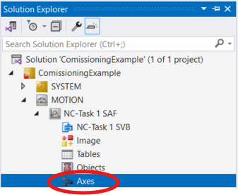

2. **Configure and Insert the Master Axis (`Axis_M`):**  
   In the **Insert NC Axis** dialog window:
   * Enter the name: `Axis_M`.
   * Keep the default type as **Continuous Axis**.
   * Click **OK**.

   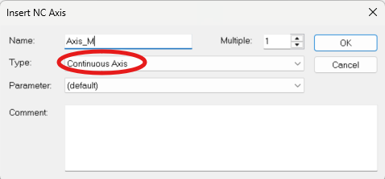

3. **Insert the Slave Axis (`Axis_S`):**  
   Repeat the process for the slave axis:
   * Right-click **Axes** $\to$ **Add New Item...**.
   * Enter the name: `Axis_S`.
   * Click **OK**.

Both NC axes are now instantiated in the motion task. In the next step, we will set up the fieldbus and hardware I/O devices before linking them together.

### Step 5: Adding Fieldbus & Hardware I/O Devices

In this step, you add the fieldbus master, servo drives, and terminal slices to the project's I/O tree. The `Tc3_LmDualAxisCoordinator` library is **independent** of fieldbus and hardware vendors - **any drive manufacturer, fieldbus protocol, or I/O slice can be used**. For this commissioning example, an **EtherCAT master with Lenze servo drives and a Beckhoff EK1100 bus coupler with digital input terminals** is used as a concrete hardware baseline. All devices are added offline.

#### Procedure:

1. **Add the EtherCAT Master Device:**  
   In the **Solution Explorer**, expand the **I/O** tree, right-click on **Devices**, and select **Add New Item...**.

   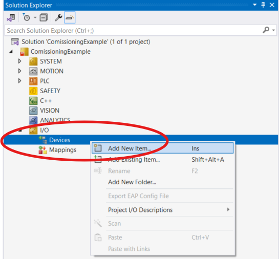

2. **Select EtherCAT Master:**  
   In the **Insert Device** dialog window, expand the **EtherCAT** group, select **EtherCAT Master**, and click **OK**.

   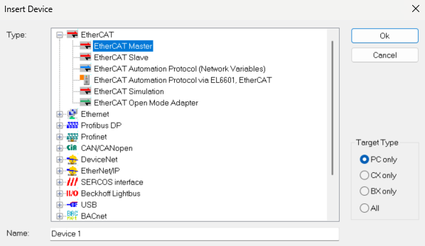

3. **Add the Servo Drives:**  
   Right-click on the created EtherCAT device and select **Add New Item...**. In the catalog dialog, select the servo drive (in this setup, the Lenze drive) and click **OK**. Repeat for both Master and Slave drives.

   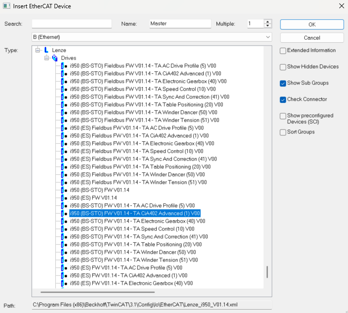

4. **Add the Bus Coupler:**  
   Right-click on the EtherCAT device $\to$ **Add New Item...**, select the EtherCAT Bus Coupler (**EK1100**), and click **OK**.

   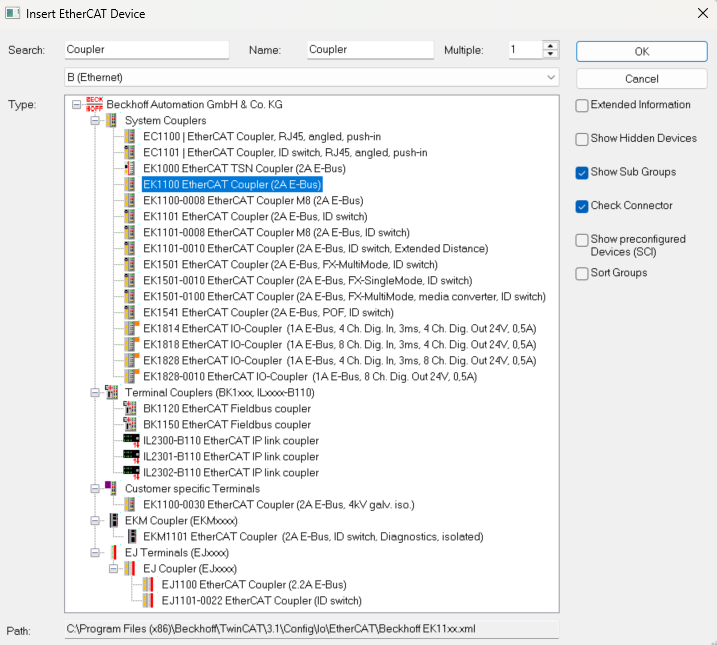

5. **Review the I/O Solution Tree:**  
   The Solution Explorer now displays the EtherCAT master with both servo drives and the bus coupler present in the hardware tree.

   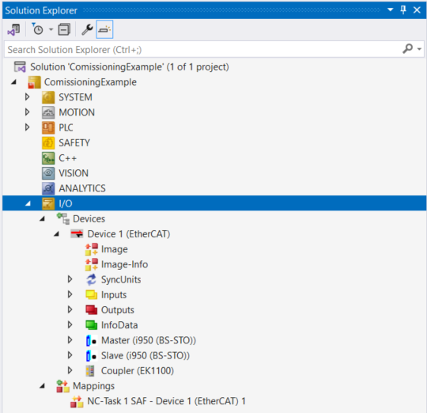

6. **Add Digital Input Terminals:**  
   Right-click on the **Coupler (EK1100)** node, select **Add New Item...**, and select your digital input terminal slice (e.g., **EL1809** or **EL1008**) used for operator pushbuttons. Click **OK**.

   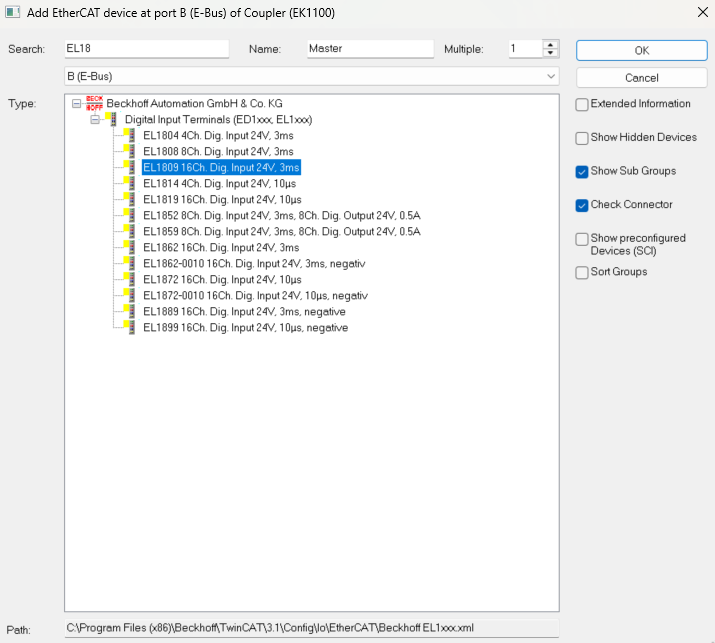

All hardware devices and I/O slices are now added to the project. In the next step, we will link the NC axes to the drives and the terminal inputs to the PLC variables.

### Step 6: Process Image Linking (Axes & Digital Inputs)

Now that the axes, PLC code, and I/O devices are added to the project, they must be linked together. This involves two distinct linking tasks:
1. Linking the TwinCAT NC axes to their corresponding PLC variables (`AXIS_REF`) and to the drive hardware.
2. Linking the physical digital inputs on the fieldbus terminal slice to the PLC input process image.

---

#### 1. Linking NC Axes (To PLC & Drive I/O)

In TwinCAT NC, every axis must know which PLC variable controls it and which physical or offline drive amplifier executes its setpoints. Both links are configured from the axis **Settings** tab.

1. **Open the Axis Settings Tab:**  
   In the **Solution Explorer**, expand **MOTION → NC-Task 1 SAF → Axes**, select your master axis (`Axis_M`), and click the **Settings** tab in the main editor.

   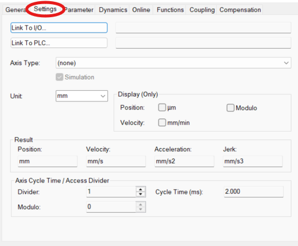

2. **Link to the PLC Reference:**  
   * On the **Settings** tab, click **Link To PLC...**.
   * In the dialog that opens, select your declared `AXIS_REF` variable (`GVL_Motion.Axis_M`) and click **OK**.
   * Repeat this step for the slave axis, selecting its declared reference (`GVL_Motion.Axis_S`).

   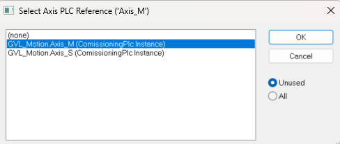

3. **Link to the Drive Hardware:**  
   * On the **Settings** tab, click **Link To I/O...**.
   * In the dialog that opens, select the matching drive amplifier (`Master (i950 (BS-STO))`) and click **OK**.
   * Repeat this step for the slave axis, selecting the slave drive (`Slave (i950 (BS-STO))`).

   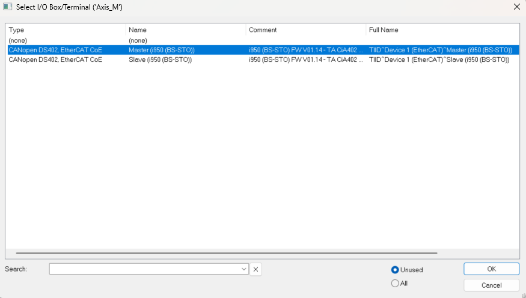

> **Note on Axis Dynamics & Kinematics:**  
> Mechanical configuration of the NC axis (such as encoder scaling, position lag monitoring limits, profile dynamics, and feedback units) depends on your specific motor, gearbox, and mechanics. These parameters are assumed to be configured by the commissioning engineer for their specific machine and are outside the scope of this motion coordinator library.

---

#### 2. Linking Field Digital Inputs (To PLC Task Image)

Physical pushbuttons mapped in the PLC process image (declared using `%I*`) must be linked to the channels of your digital input terminal slice.

1. **Locate PLC Task Inputs:**  
   In the **Solution Explorer**, expand **PLC → [Your PLC Project] → [Your PLC Instance] → PlcTask Inputs** (`ComissioningPlc → ComissioningPlc Instance → PlcTask Inputs`).  
   Expand the physical input structure (`GVL_IO.stMaster_Physical_In`) to view the unlinked boolean variables.

2. **Initiate Variable Link:**  
   Right-click on the input variable you want to map (e.g., `xPowerEnableBtn`) and select **Change Link...** (or **Link Variable...**).

   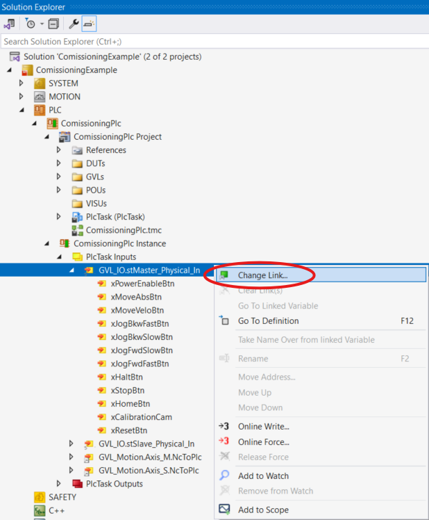

3. **Attach Terminal Channel:**  
   In the **Attach Variable** dialog:
   * Expand your fieldbus tree down to the digital input terminal slice (`Master (EL1809)`).
   * Select the corresponding physical channel bit (e.g., `Input > IX 141.0, BIT [0.1]`).
   * Click **OK**.

   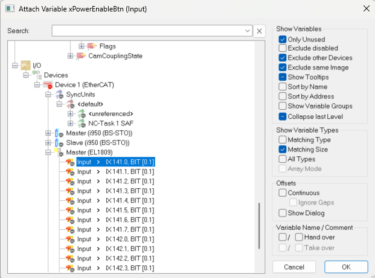

4. **Complete Remaining Mappings:**  
   Repeat this procedure to link the remaining command signals (`xMoveAbsBtn`, `xMoveVeloBtn`, `xJog...`, `xStopBtn`, etc.) and the slave inputs (`GVL_IO.stSlave_Physical_In`) to their respective physical terminal channels.

Both the motion interfaces and the process I/O channels are now linked. In the next step, we will configure the project to run offline on an engineering PC without physical hardware.

### Step 7: Running on a PC (Axis Simulation & I/O Disabling)

If you are running this project on an engineering PC without physical drives and terminals connected, TwinCAT would normally report communication faults and missing-hardware errors upon startup. 

To run and verify the complete motion logic offline without losing any of the mappings configured in Step 6, two adjustments are required: enabling NC axis simulation and disabling the fieldbus device.

#### Procedure:

1. **Enable NC Axis Simulation:**  
   In the **Solution Explorer**, expand **MOTION → NC-Task 1 SAF → Axes**, select `Axis_M`, and open the **Settings** tab:
   * Check the **Simulation** checkbox.
   * Repeat this for `Axis_S`.

   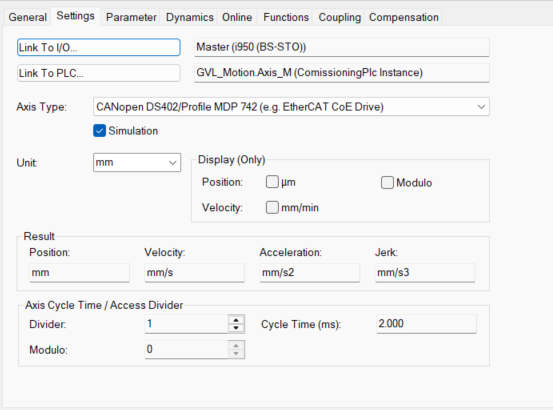

   > **How Axis Simulation Works:**  
   > Checking this box instructs the TwinCAT NC setpoint generator to loop its commanded position and velocity setpoints directly back into the actual feedback registers. This allows the axis to simulate motion, reach position, and follow gear trajectories internally without requiring physical drive feedback, while keeping all PLC and I/O linkages intact.

2. **Disable the Fieldbus Device:**  
   In the **Solution Explorer**, expand **I/O → Devices**:
   * Right-click on your fieldbus master device (here: `Device 1 (EtherCAT)`).
   * Select **Disable** from the context menu.

   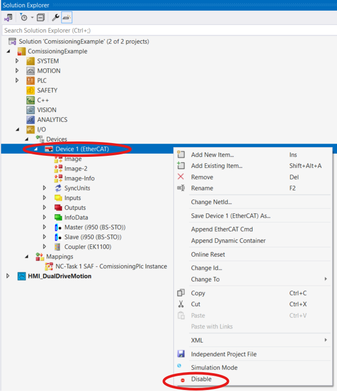

   > **Why Disabling the Device is Required:**  
   > Disabling the fieldbus master informs the TwinCAT runtime to skip initializing the physical network card and fieldbus line. This prevents "Cable Link Disconnected" and missing slave errors during system activation. All terminal variables and drive links remain fully preserved in the project.

With simulation enabled and fieldbus errors suppressed, the solution is now ready to be activated and driven from the HMI.

### Step 8: Activation, Run Mode & HMI Deployment

With axis simulation enabled and physical I/O disabled, the solution is ready to be activated, placed into Run Mode, and operated from the web HMI.

#### Procedure:

1. **Activate Configuration & Enter Run Mode:**  
   * In the top toolbar of TwinCAT XAE, verify that the target system dropdown is set to **`<Local>`** (`127.0.0.1.1.1`).
   * Click the **Activate Configuration** button (the blue gear icon).
   * When prompted with *"Restart TwinCAT system in Run Mode?"*, click **OK**.
   * The TwinCAT tray icon in the Windows taskbar turns solid **Green**, confirming that Run Mode is active.

   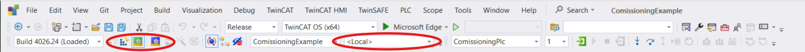

2. **Log In and Start the PLC Runtime:**  
   Once TwinCAT is in Run Mode, the PLC runtime must be started:
   * Click the **Login** button to connect to the runtime.
   * Click the **Start** button (the green play logic icon in the top toolbar) or press **F5** to start execution.
   * The PLC runtime is now actively cycling the logic and executing the coordinator.

   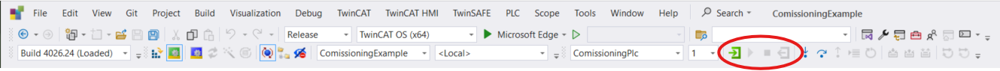

3. **HMI Project Structure:**  
   You can create your own TwinCAT HMI project or integrate an existing one into the solution, just as configured in this commissioning example (`HMI_DualDriveMotion`).

   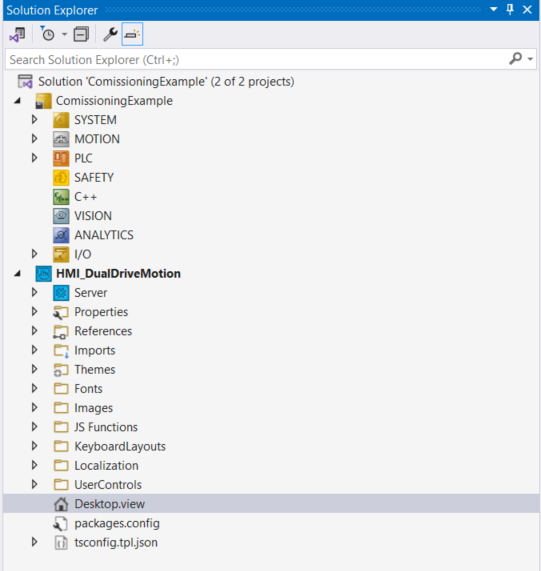

4. **Launch the HMI via Live-View:**  
   In the top section of TwinCAT XAE, click the **TwinCAT HMI Live-View** button to launch the operator interface.

   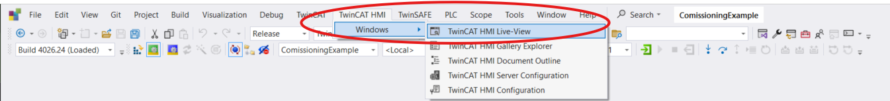

5. **HMI Dashboard Overview:**  
   The browser opens the operational dashboard:
   * **Coordinator Deck:** Select pairing topologies (`BI_PARTING`, `TELESCOPIC`, `CUSTOM`), trigger gearing/uncoupling commands, and execute cell-wide fault resets.
   * **Live Kinematic Rail:** Displays dynamic 2D positions of Master and Slave carriages in real time.
   * **Axis Faceplates:** Individual controls for Master and Slave drives providing maintained power toggles, manual jog consoles, homing calibration, and status LEDs.

   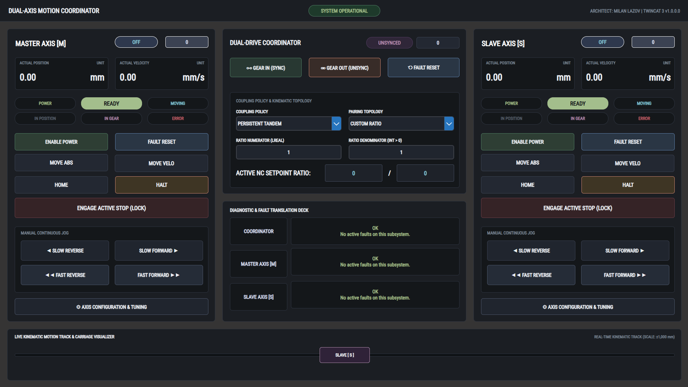

The application is now fully running and ready for operation. In the next section, we will walk through the live feature demonstrations.

## 3. Live Feature Demonstrations

This section provides operational walkthroughs of the motion control library and HMI in action, explaining what is occurring on screen and the engineering rationale behind each feature.

---

### 1. Axis Configuration & Tuning Drawer

https://github.com/user-attachments/assets/c0b47eb0-26cb-4506-853e-e0741a462834

* **What It Shows:** Accessing the slide-out tuning drawer from the axis faceplate to inspect and configure kinematic dynamics: operational velocities, acceleration/deceleration ramps, S-curve jerk smoothing, manual jog limits, and supervisory timeouts.
* **Why It Matters:** Allows commissioning engineers to tune axis dynamics live during machine setup without recompiling or downloading PLC code.

---

### 2. Controlled Deceleration Stop on Software Disable

https://github.com/user-attachments/assets/da4c922e-e245-4954-876a-53b202a747ea

* **What It Shows:** An axis is traveling at full operational velocity. Dropping the software enable signal (`xPowerEnable := FALSE`) does not immediately drop the drive power stage; instead, the controller automatically commands a controlled deceleration stop to 0.0 mm/s before de-energizing the drive.
* **Why It Matters:** Cutting drive bridge power while an axis is moving drops holding torque instantaneously, causing mechanical shock, uncontrolled freewheeling, and NC following error faults. Decelerating to standstill first protects the drivetrain and leadscrews.

---

### 3. On-The-Fly Trajectory Retargeting (MoveAbs & MoveVelo Ping-Pong)

https://github.com/user-attachments/assets/4449e3c7-6c00-4f69-b5e2-4860840f82e5

* **What It Shows:**  
  1. **MoveAbs Ping-Pong:** While executing an absolute move, pulsing a new target coordinate flips between alternating positioning instances (`fbMoveAbsolute1` / `fbMoveAbsolute2` with `BufferMode := MC_Aborting`), recalculating the trajectory mid-flight without stopping or velocity dips.  
  2. **MoveVelo Ping-Pong:** While running in continuous velocity, updating the speed, dynamics, or direction and pulsing `xMoveVelo` alternates between velocity instances (`fbMoveVelocity1` / `fbMoveVelocity2`), smoothly recalculating the velocity ramp on the fly without an execution deadband or cycle delay.
* **Why It Matters:** Eliminates stop-and-go cycle latency in automated material handling, sorting conveyors, and automatic door systems when target destinations or production line speeds change dynamically mid-motion.

---

### 4. Coupling Policy: PERSISTENT_TANDEM

https://github.com/user-attachments/assets/7a94cf77-6abc-49e8-b9f6-180a2f73df53

* **What It Shows:** Electronic gearing persists across software power cycles. If power is removed, axes power down geared and remain coupled in the NC kernel. Both stations must assert power enable before either drive is permitted to energize (dual-permissive power). Tripping or stopping either axis triggers an immediate cross-stop on the partner.
* **Why It Matters:** Designed for rigid mechanical pairings (e.g., dual-driven gantries or mechanically linked leadscrews) where independent movement or unsynchronized power-up would cause physical binding or frame distortion.

---

### 5. Coupling Policy: MODULAR_TANDEM_STOP

https://github.com/user-attachments/assets/8b5d65cc-615e-4b9c-94af-90ea81d161ef

* **What It Shows:** Axes power up independently. When software power is removed while coupled, the coordinator automatically executes `MC_GearOut` to dissolve electronic gearing before entering standby. While coupled, collective safety is enforced: stopping or faulting the slave axis initiates an immediate cross-axis stop on the master.
* **Why It Matters:** Ideal for dynamic pick-and-place or multi-belt transfer systems that synchronize on demand during production but decouple during maintenance, while still requiring collective safety when coupled.

---

### 6. Coupling Policy: MODULAR_INDEPENDENT

https://github.com/user-attachments/assets/43dd3a2f-9f25-40ac-9ed5-0659d21c4cea

* **What It Shows:** Axes power up independently and automatically decouple on power-down via `MC_GearOut`. Unlike the tandem policies, the master axis maintains complete trajectory autonomy: if the slave axis is halted, stopped, or uncoupled, the master continues its motion profile uninterrupted.
* **Why It Matters:** Designed for process flows where the master axis drives the main line (e.g., a continuous packaging conveyor) and auxiliary slave axes synchronize only for intermittent operations without being permitted to halt main line throughput.

---

### 7. Electronic Decoupling in Motion

https://github.com/user-attachments/assets/adf48245-4c0c-4540-ac46-660c0d8715fe

* **What It Shows:** Commanding `xCmdGearOut` while the axes are actively traveling coupled. The NC setpoint table link dissolves, the slave axis is brought to a controlled stop, and the master behavior responds according to the active coupling policy.
* **Why It Matters:** Demonstrates clean NC setpoint dissolution on the fly without causing kinematic step jumps or NC synchronization alarms.

---

### 8. Dynamic Pairing Topologies & Standstill Re-Gearing

https://github.com/user-attachments/assets/7e3173f2-8dd9-4360-a442-9725e0e36d35

* **What It Shows:** The coordinator is electronically geared under the `CUSTOM` topology. Updating numerator or denominator inputs while coupled asserts `xRegearRequired`. Once the axes reach standstill, pulsing `xCmdGearIn` automatically executes a sequential uncouple-and-recouple sequence (`GEARING_OUT` $\to$ `GEARING_IN`) to lock the new gear ratio.
* **Why It Matters:** Allows production lines to switch product recipes or gear ratios on the fly without rebooting TwinCAT or cycling machine power.

---

### 9. External NC Motion Tracking (EXTERNAL_MOTION)

https://github.com/user-attachments/assets/ca0a8b4c-85df-42b1-9c1d-34ea392c9abc

* **What It Shows:** While the axis is resting in `IDLE`, an engineer manually jogs the axis directly using the TwinCAT NC Axis Online tab hotkeys (F1–F4). The controller detects unauthorized motion, transitions to `EXTERNAL_MOTION`, sweeps all internal PLC motion blocks to false, and automatically returns to `IDLE` once standstill is confirmed.
* **Why It Matters:** Prevents PLC command collisions with commissioning engineers working in the NC Online tab and guarantees that supervisory coordinators always receive truthful telemetry of physical movement.

---

### 10. Deceleration Dynamics: Halt vs. Stop

https://github.com/user-attachments/assets/5ae66df8-1fab-4818-b146-06ac3d9af17d

* **What It Shows:**  
  1. **MC_Halt (Abortable):** A halt command begins decelerating the axis to rest, but issuing a new positioning command mid-ramp preempts the halt immediately, resuming travel without reaching standstill.  
  2. **MC_Stop (Interlocked Lock):** A stop command locks the setpoint generator in the NC kernel, actively rejecting new motion commands until standstill is reached and the stop signal is released.
* **Why It Matters:** Proves the difference between operational pauses (abortable halts) and interlocked holds (stops), preventing command contention during machine cycle interruptions.

---

### 11. Manual Continuous Jogging

https://github.com/user-attachments/assets/dd72f1b1-430a-452e-b435-7f0fe2ced5d7

* **What It Shows:** Manual continuous jogging in forward and reverse directions utilizing dynamic slow and fast velocity setpoints, executing smooth, controlled deceleration ramps to standstill upon releasing the command buttons.
* **Why It Matters:** Essential for manual axis setup, fixture alignment, and teach-pendant operations without triggering autonomous positioning profiles.

---

### 12. Simultaneous Dual-Axis Homing Calibration

https://github.com/user-attachments/assets/c7631701-c7fd-492c-8752-e30b696cd5e0

* **What It Shows:** Axes are uncoupled and calibrated simultaneously. Each axis executes its referencing sequence with independent homing modes and offset coordinates, establishing calibrated zero baselines concurrently.
* **Why It Matters:** Drastically reduces machine startup and shift initialization time by referencing multiple axes concurrently rather than sequentially.

---

### 13. NC Dynamic Limit Fault & Hardware Recovery Handshake

https://github.com/user-attachments/assets/4a2242a6-d72c-4dc0-a832-08a5d04c3155

* **What It Shows:** Setting a kinematic profile parameter (e.g., `lrMaxVelocity`) in the tuning drawer higher than the maximum limit configured in the TwinCAT NC Axis parameters tab, then commanding motion. The TwinCAT NC kernel setpoint generator rejects the trajectory and trips an NC error (e.g., `16#4221` in the `16#4000`–`16#4FFF` pass-through range). The controller captures the NC error code, displays it on the HMI, and executing a reset triggers an NC hardware reset (`MC_Reset`), confirming that the NC fault is cleared before returning the axis to `IDLE`.
* **Why It Matters:** Demonstrates fault recovery under a genuine NC kernel trip: executing `MC_Reset`, arbitrating task scan synchronization, and verifying that the NC error register is clear before re-arming the machine into standby.
